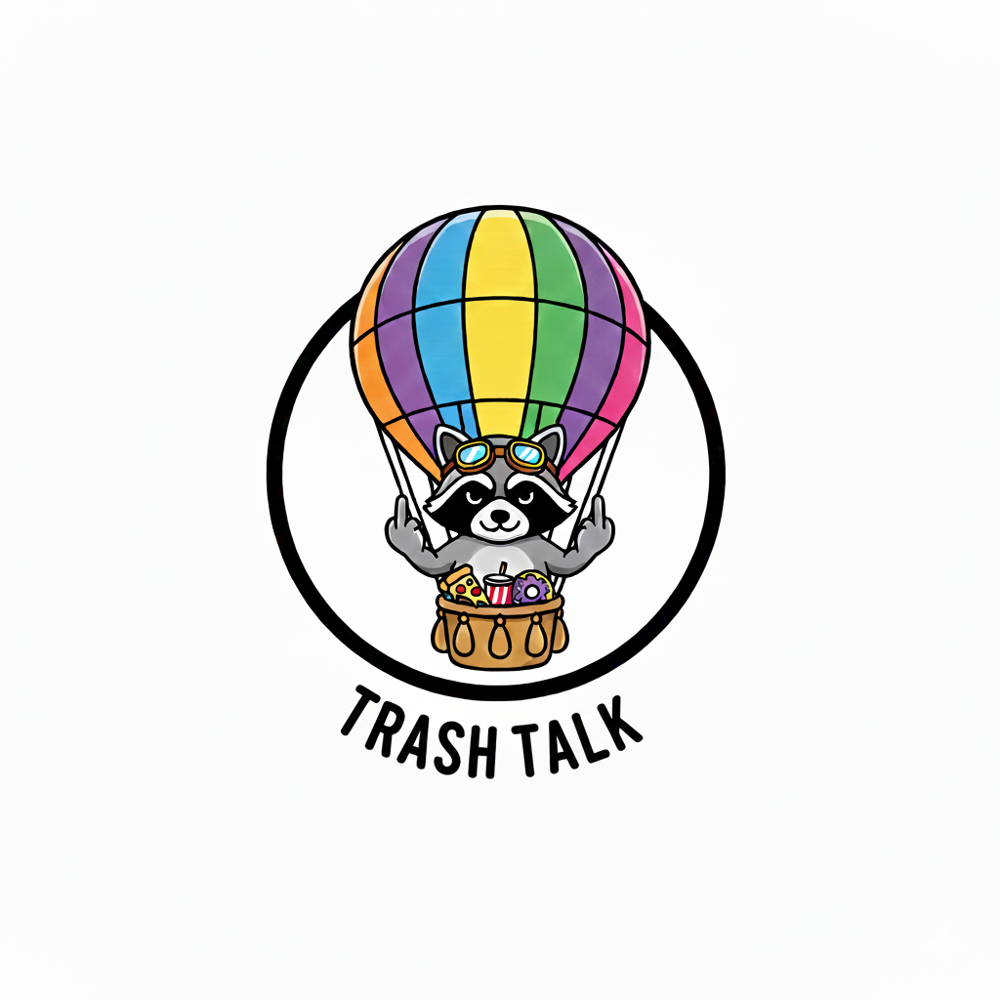

<p align="center">
  
</p>

# Trashtalk

A Smalltalk-inspired language and message-passing runtime for Bash. `.trash`
classes compile to Bash functions; the `@` dispatcher provides inheritance,
traits, and persistent objects backed by SQLite. The jq compiler is canonical.

Trashtalk began as an experiment in expressive personal tool-making on the
substrate of shell scripting. It now includes object browsing, process and file
tools, inboxes, and agent workflows. It remains Bash-only.

## Install

Required: Bash 4.4+, `jo`, jq 1.6+, `sqlite3`, `uuidgen`, Perl, `make`, and
`shasum`. Perl uses core `JSON::PP`, `Digest::SHA`, and `Time::HiRes` modules.
Tests also need `timeout` (GNU coreutils on macOS).

- macOS: `brew install bash jo jq sqlite coreutils`. Put Homebrew's Bash first
  on `PATH`, then run `exec bash`; `/bin/bash` 3.2 and Zsh are not supported.
- Debian/Ubuntu: `sudo apt install bash jo jq sqlite3 uuid-runtime make perl libdigest-sha-perl coreutils`.

```bash
git clone https://github.com/chazu/trashtalk.git ~/.trashtalk
cd ~/.trashtalk
make
source lib/trash.bash
@ Trash info
```

Add `source ~/.trashtalk/lib/trash.bash` to your Bash startup file. If installed
elsewhere, set `TRASHTALK_DIR` to that checkout before sourcing the runtime.
`@ Trash doctor` checks dependencies and optional integrations; with the Maki
profile selected, it can also install a missing Maki executable.

## Try it

<!-- smoke: walkthrough -->
```bash
counter=$(@ Counter new)
@ "$counter" setValue: 5
@ "$counter" incrementBy: 3
@ "$counter" getValue                 # 8
@ "$counter" save

items=$(@ Array new)
@ "$items" push: hello
@ "$items" push: world
@ "$items" at: 0                       # hello

@ Trash methodsFor: Counter
```

Creation persists initial state. Later changes live in the runtime's session
cache until saved; `reload` reads the durable state. See
[persistence](docs/persistence.md) for ownership and transaction rules.

A class file expresses behavior in the DSL:

<!-- smoke: class -->
```smalltalk
Greeting subclass: Object
  classMethod: for: name [
    ^ 'Hello, ' , name
  ]
```

Save it as `trash/user/Greeting.trash`, run `make single CLASS=Greeting`, then
send `@ Greeting for: Ada`. Prefer `method:` and `classMethod:` for domain
logic. Keep `rawMethod:` and primitives at Bash, filesystem, process, and
serialization boundaries. A method's stdout is its value; use `pragma: stream`
when several statements intentionally print output.

## Configure

Settings such as Gusgus's harness and each harness's model live in
`~/.config/trashtalk/config` (or `$XDG_CONFIG_HOME/trashtalk/config`), a flat
TOML file you can keep in a dotfiles repository:

```toml
gusgus.profile = "jcode"
jcode.model = "gpt-5.6-terra"
agent.controlWait = 30
```

```bash
@ Config list                    # every setting, its value, and its source
mkdir -p ~/.config/trashtalk     # start a commented file listing every default
@ Config template > ~/.config/trashtalk/config
@ Config at: 'jcode.model' put: 'gpt-5.6-terra'   # edit the file from the REPL
@ Config reset: 'jcode.model'    # remove the line so the default applies
```

Each setting's environment variable, such as `TRASHTALK_JCODE_MODEL`, overrides
the file, which overrides the default. `@ Config template` names every variable.
`at:put:` keeps the file's comments and order and writes through a symlink.
Settings are read when a harness starts, so restart a session to apply a change.
`@ Trash doctor` reports unknown keys, invalid values, and overriding variables.
Keep API keys in the environment, not in this file. See the
[configuration design](docs/config-design.md) for the format.

## Work on the code

```bash
make                         # Build changed classes and dependencies
make single CLASS=Counter    # Build one class through the same cache
make verify                  # Build and run both isolated test suites
make test-serial              # Runtime tests, one file at a time
make test-verbose             # Runtime tests with Bash tracing
```

`TRASH_TEST_JOBS` and `TRASH_TEST_TIMEOUT` control test concurrency and per-file
timeouts. Tests use disposable checkouts, databases, and caches. See
[performance](docs/performance.md) for benchmarks and profiling.

Run `bin/trash` for a Readline REPL with history and completion. Optional Innards
applets provide editing, browsing, inspection, and conversation views; see
[development tools](docs/development-tools.md). Emacs users can add the `emacs/`
directory to `load-path` and `(require 'trashtalk-mode)`.

## Optional integrations

- `@@ message` sends a durable inbox message to Gusgus. Session setup, backend
  selection, stop, and recovery are in [agent operations](docs/agent-operations.md).
- One-shot `Agent` calls use the Codex CLI with ChatGPT authentication and an
  ephemeral read-only execution boundary; see [tool adapters](docs/code-and-session-tools.md).
- Honker adds SQLite-backed events, queues, streams, locks, and scheduling.
  `bin/install-honker` builds it using Cargo. It requires an extension-capable
  `sqlite3`; select one with `TRASH_SQLITE3` if necessary. Core object operations
  do not require Honker; Honker-dependent features do.
- [Workstation subscriptions](docs/workstation-guide.md) collect command failures
  and support reviewed delegation. [Typed decisions](docs/typed-decisions.md)
  provide shared question/answer workflows.

## References

| Need | Read |
| --- | --- |
| Syntax and language limitations | [LANGUAGE.md](LANGUAGE.md) |
| Small, executable DSL recipes | [Patterns](docs/trashtalk-patterns.md) |
| Design idioms and domain examples | [The Way of Trashtalk](docs/the-way-of-trashtalk.md) |
| Compiler architecture | [jq compiler](lib/jq-compiler/README.md) |
| Current guides, designs, and history | [Documentation index](docs/README.md) |
| Accepted cleanup work and validation | [Cleanup checklist](docs/cleanup-2026-09-29.md) |

Source classes live in `trash/`, generated artifacts in `trash/.compiled/`,
the runtime in `lib/trash.bash`, and entry points in `bin/`. Generated artifacts
are derived data. The retired native compiler, plugin mode, and `tt` daemon
are not part of the build.
