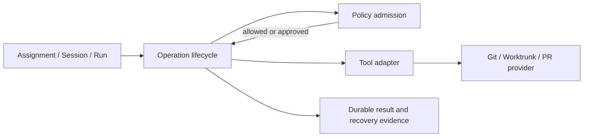

# Agent workspace operations and policy

**Status:** proposed design. This document records a direction for discussion;
it does not introduce a repository/worktree domain model or authorize Git
mutation.

## Purpose

Trashtalk needs to manage isolated checkouts for coding agents without making a
convenient CLI command the policy engine. The same separation must later cover
branch, merge, push, pull-request, and cleanup operations.

This design separates four concerns:

1. **Operation adapters** execute exact external commands.
2. **Policy** decides whether a requested operation is allowed, needs explicit
   approval, or is denied.
3. **Operation lifecycle** records intent, admission, result, and recovery.
4. **Agent orchestration** associates an approved workspace with an Assignment,
   `Agent::Session`, and `Agent::Run`.

No layer may infer permission merely because another layer has a useful CLI.

## Goals

- Let a person declare policy at both machine and project scope.
- Keep machine policy as a non-bypassable ceiling. Project policy may narrow it,
  never expand it.
- Support several operation providers without changing policy semantics:
  Worktrunk, Git, and later a pull-request provider are interchangeable command
  boundaries.
- Make each destructive operation explicit, attributable, idempotent, and
  recoverable after a process crash.
- Keep the human's checkout and dirty changes intact by default.
- Reuse existing Assignment, identity, role, session, run, Store transaction,
  Inbox, and Message infrastructure where their present responsibilities fit.

## Non-goals

- Automatically merge, push, open/close a pull request, delete a branch, or
  remove a worktree.
- Treat a worktree as an OS security boundary.
- Treat a project config file as authority to exceed machine policy.
- Put external command invocation, path canonicalization, Store reads, or
  authorization decisions into a declarative schema language.
- Commit to a durable `Repository` / `LocalRepository` / `Worktree` hierarchy
  before the first allocation workflow proves what must survive independently
  from an Assignment.

## Current implementation

### Existing operation boundaries

- `Tools::Git` is read-only. It obtains a checkout root, common Git directory,
  HEAD, current branch, porcelain status, and `worktree list --porcelain` from
  an explicit directory.
- `Tools::Worktrunk` is read-only. It runs `wt list` in an explicit directory.
- Neither adapter creates a branch/worktree, merges, pushes, removes, or knows
  about agents, Assignments, policy, or persisted state.

### Existing agent and Assignment state

`Assignment` is a durable responsibility record, not an operation record. Its
only lifecycle is:

```text
open -> completed
open -> cancelled
```

A human-owned draft can be completed before it is entrusted. While open, it can
be assigned to an enabled `Agent::Identity`. `workIn:` selects one eligible
`Agent::Session` at a time, increments the Assignment generation, and publishes
one durable work Message and `Agent::Delivery`. A later selected session
supersedes the prior delivery only when neither session has an active run.

`Agent::Session` is a durable conversation binding an identity, profile, role
revision, and canonical workspace path. Its lifecycle includes open, paused,
closed, reopened, and terminated states. `Agent::Run` is one execution of that
session, with a capability token, heartbeat, recovery, and controlled stop.
The worker serializes active work per session and reconciles runs after restart.

A Delivery is the handoff state machine, separate from Assignment state:

```text
pending / blocked -> offered -> processed
                    \-> skipped
```

An agent run can claim only the current Assignment generation, current delivery,
current session, correct assignee identity, matching role revision, and an
`assignment.work` capability. Completion also refuses unresolved questions and
competing active runs.

### Existing policy-adjacent checks

- `Assignment::Authority` authenticates the human owner or the active run's
  capability token. `Agent::Run actingContext` is authenticated caller context,
  not a general policy engine.
- `Agent::Role` is versioned and immutable once defined. It holds capabilities,
  workspace-prefix policy, recipient policy, approval policy, and run/message
  budgets.
- Session scope and worker admission recheck identity ownership, lifecycle,
  workspace, delivery, and role policy at use time.
- Workstation routing separately has target/session, workspace, recipient, and
  budget admission for delegation from local attention.

These checks answer whether a run may receive and act on assigned work. They do
**not** express whether an agent may allocate a Git worktree, create a branch,
merge, push, or create a pull request. There is no machine/project operation
policy, operation decision, operation intent, allocation reservation, or
repository-wide mutation lock today.

## Proposed boundaries



### 1. Tool adapters

A Tool adapter has typed operation-shaped messages and produces a bounded
process result. It does not inspect an agent identity, read policy files, or
persist domain decisions. It may validate its immediate input contract.

The adapters eventually needed are distinct:

| Adapter | Responsibility | Examples |
|---|---|---|
| `Tools::Git` | Git observation and low-level Git actions | inspect HEAD, create branch, inspect diff |
| `Tools::Worktrunk` | Worktrunk-specific allocation and cleanup mechanics | allocate or find a named worktree |
| future PR adapter | Provider-specific pull-request actions | open draft, inspect status, merge after approval |

The policy operation name must be provider-neutral. For example,
`allocate_worktree` is not `wt_switch`; an implementation may use Worktrunk or
Git after policy admission.

### 2. Policy admission

A policy evaluator receives a fully resolved request:

```text
actor, assignment, identity, session, role revision,
source checkout, canonical root/common Git directory, requested operation,
requested branch/path/provider parameters, and current Git evidence
```

It returns one closed result:

```text
allowed | approval_required | denied
```

plus an ordered list of reasons, the applicable machine/project policy
revisions, and an operation fingerprint. A decision is evidence, not an effect.
The operation lifecycle rechecks it in the transaction immediately before an
effect and records the decision used.

The evaluator must own these live checks in ordinary Trashtalk code:

- canonical path and Git common-directory matching;
- Assignment owner, identity, role, session, and run authorization;
- whether the Assignment remains open and the selected generation is current;
- branch/path name collision and current worktree ownership;
- dirty-state policy and whether committed versus uncommitted source is allowed;
- per-machine/project/assignment concurrency and budget limits;
- active leases and repository-wide mutation serialization;
- required human approval and expiry of an earlier approval.

### 3. Configuration scopes

The intended sources are one machine policy and an optional project policy.
Exact file names and format remain open, but the likely locations are:

```text
~/.config/trashtalk/agent-operations.*
<checkout-root>/.trashtalk/agent-operations.*
```

Machine policy establishes the maximum authority for this machine: trusted root
paths, eligible providers, maximum active allocations, whether particular
operation kinds are available at all, and which agent roles can request them.
It is an allowlist and defaults to deny.

Project policy expresses local restrictions and workflow preferences: permitted
branches/templates, whether a clean base is required, required human approval,
project setup/validation declarations, and project-specific limits. It cannot
add a root, provider, role, or operation forbidden by machine policy.

Effective policy is an explicit restrictive intersection, not a generic deep
merge. Examples:

- an operation must be allowed by both scopes;
- a root must satisfy both root allowlists when both are present;
- the smallest nonzero concurrency limit wins;
- either scope may require approval;
- project policy cannot turn machine `denied` into `allowed`.

Missing machine policy means no agent-controlled mutation. A project policy by
itself is descriptive until a machine policy allows that project root.

### 4. Operation lifecycle

The effect layer needs one durable, idempotent record or an equivalent clearly
owned set of Assignment fields. It must represent at least:

```text
requested -> admitted -> executing -> succeeded | failed | cancelled
```

Before invoking a provider, persist an immutable request key, requester,
Assignment, policy revisions, source checkout evidence, requested branch/path,
and intended owner. Afterward, record returned path, branch, base/result commit,
provider output, and validation evidence.

On retry or restart, reconcile Git's actual porcelain worktree inventory and
ownership before issuing another create. Never retry by blindly creating a
second similarly named checkout. Cleanup is a separate operation with its own
admission and safety checks.

Whether this is one `Agent::Operation` / `Agent::WorktreeLease` object or a
small extension of Assignment is deliberately unresolved. Start with the
smallest model that can preserve independent recovery and ownership. A single
Assignment may eventually need multiple attempts or worktrees, which argues
against overloading one mutable Assignment field.

### 5. Agent orchestration

After a successful allocation, orchestration may create or select an eligible
session for the allocated path and publish Assignment work normally. It must
not silently retarget a running session. The current Assignment contract
requires the selected session's canonical workspace to equal the Assignment
workspace, so a first implementation must make source context and execution
workspace explicit rather than overwriting one path without history.

A safe initial arrangement is:

1. the human creates a draft against an explicit source checkout;
2. the human requests `allocate_worktree` for that Assignment;
3. admission records the source root and committed base, then creates one named
   isolated checkout;
4. a fresh compatible session is opened in that execution workspace;
5. Assignment work is published to that session through the existing Delivery
   path;
6. completion returns branch, diff/base/result commits, and validation evidence
   to the human.

The human alone performs later review, merge, push, pull-request, branch
removal, and worktree cleanup until separate policies and lifecycle operations
exist for each.

## CUE as an option

CUE is useful if we choose a configuration format with a strong structural
contract. It is not required, and it must not become the live authorization or
effect engine.

| Option | Benefits | Costs / limits |
|---|---|---|
| CUE schema plus data files | Closed versioned documents, defaults, fixture validation, useful diagnostics | Adds a CUE dependency and a conversion boundary |
| JSON/TOML plus DSL validation | Fewer dependencies and direct shell-friendly loading | More structural validation must be maintained in Trashtalk |
| CUE for authoring, exported JSON at runtime | Good authoring constraints with simple runtime input | Build/export workflow and stale generated-file concerns |

If adopted, CUE should validate only static data such as schema version,
operation vocabulary, branch-template shape, root declarations, limit values,
and approval modes. Trashtalk must still perform canonicalization, policy
precedence, restrictive intersection, runtime identity/session checks, Git
reconciliation, transactionality, and all external effects.

A reasonable experiment is a closed `operation-policy` schema and fixtures for
valid machine policy, valid restrictive project policy, unknown fields,
malformed values, and a project attempt to widen machine authority. Do not wire
it to mutation until the policy semantics have a manual walkthrough.

## Phased delivery

### Phase A: policy contract and observation

- Choose a config representation after comparing CUE and a native alternative.
- Define the provider-neutral operation vocabulary.
- Load, validate, display, and explain effective policy without executing an
  operation.
- Use existing read-only Git/Worktrunk observations to show canonical checkout,
  common directory, branch, HEAD, dirty status, and current worktrees.

### Phase B: dry-run admission

- Implement a pure, inspectable admission result for `allocate_worktree`.
- Combine machine and project policy restrictively.
- Recheck existing Assignment, role, session, and run policy rather than copy
  it into the new config.
- Persist nothing and execute nothing in dry run.

### Phase C: one explicit allocation

- Add a durable request/lease record and a single explicit human action.
- Allocate one isolated branch/worktree from a committed base through a selected
  provider.
- Reconcile interruption, duplicate request, path collision, and provider
  partial-success cases.
- Open/select a session only after allocation succeeds.

### Phase D: later independent operations

Add branch creation, validation/setup hooks, pull-request creation, push,
merge, and cleanup one operation at a time. Each gets a policy entry, approval
semantics, lifecycle/recovery behavior, and destructive-safety tests. None is
implicitly included because `allocate_worktree` was allowed.

## Acceptance criteria for the first mutation slice

- Without machine policy, no agent-controlled Git mutation can run.
- A project file cannot broaden a machine deny or escape an allowed root.
- A dry run gives an explainable decision and causes no filesystem, Git, Store,
  message, session, or harness change.
- One approved request yields at most one owned worktree after restart/retry.
- A dirty human checkout is neither stashed, copied, reset, nor deleted.
- A running session is never retargeted to another directory.
- Human review and cleanup remain explicit, with branch/diff/commit evidence.
