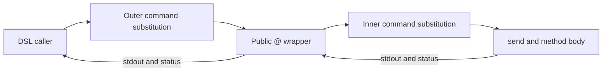

# Result passing for compiled Trashtalk methods

Status: proposal for discussion. This document does not change the result ABI.
Date: 2026-09-05.

## Recommendation

Prototype removal of the redundant inner capture for compiler-generated value
sends first. Keep the outer command substitution and the public `@` behavior.
Measure that smaller change before committing to a new method result ABI.

A direct result channel could eventually remove both captures for suitable DSL
methods, but it also changes where code executes. That requires an explicit
contract for shell effects, dynamic dispatch, callbacks, and mixed old/new
artifacts. It should be a separate compiler/runtime change.

The four preceding improvements already reduce Block decoding, object
initialization, instance reads, and build validation. This proposal targets the
remaining cost of transporting a method result between Bash functions.

## The current path

For this DSL assignment:

```smalltalk
answer := @ counter getValue.
```

The generated Bash currently resembles:

```bash
answer="$(@ "$counter" getValue)"
```

Inside `@`, the ordinary path does this:

```bash
result=$(send "$@")
status=$?
[[ -z "$result" ]] || __="$result"
[[ -z "$result" ]] || echo "$result"
return "$status"
```

The public wrapper also resolves the receiver, sources its class, and checks
`pragma: direct`. `send` owns selector parsing, dispatch, runtime context,
advice, exception cleanup, and profiling. The snippets above omit those steps;
they are not replacement implementations.



This means two nested command substitutions for an ordinary assigned send,
although the method may only print a number. A bare terminal `@` call has one.
Other expressions, field helpers, and nested sends can introduce more.

Bash runs ordinary command substitutions in a subshell environment and removes
trailing newlines from the captured output. That is part of the existing
behavior, not just an implementation cost. See the
[Bash command-substitution contract](https://www.gnu.org/s/bash/manual/html_node/Command-Substitution.html).

## Observable behavior to preserve

| Concern | Current behavior and required compatibility |
| --- | --- |
| Public result | Ordinary `@` sends emit the captured nonempty result to stdout. Diagnostics use stderr. |
| Last result `__` | A nonempty result updates `__` in the shell executing `@`. An empty result leaves it unchanged. Updates made inside an outer capture do not reach its parent shell. |
| Whitespace | Ordinary capture strips trailing newlines. Embedded newlines, quotes, and empty strings need explicit coverage. Bash variables cannot represent NUL. |
| Status | Method status flows back through dispatch. A failed method can also produce stdout. A new transport must not silently convert that into success or discard the output. |
| Caller error policy | Ordinary assignment and checked JSON primitives do not currently have identical failure handling. Transport changes must preserve the caller's existing policy. |
| Shell effects | Normal capture isolates shell-variable, directory, option, and trap changes. File, database, and external-process effects can remain visible. |
| Direct methods | `pragma: direct` bypasses the inner capture. Callback bindings, reload operations, and terminal operations depend on their existing execution environment. |
| Dispatch | Receiver resolution, inheritance, traits, overrides, and class reloads remain authoritative. The compiler cannot assume a selector always names one fixed Bash function. |
| Cleanup | Advice, ensure/handler stacks, call-stack cleanup, and profiling must run with the same ordering and status behavior. |
| Reentrancy | Nested sends and callbacks must not overwrite an outer method's pending result or runtime context. |

Dynamic local-variable visibility is another reason to avoid a single global
result slot: called Bash functions can see locals in their callers. Use distinct,
validated compiler-owned names and explicit frame ownership. See
[Bash function scoping](https://www.gnu.org/s/bash/manual/html_node/Shell-Functions.html).

## Option A: one capture for compiled value sends

Add a private runtime entry point used only inside a compiler-generated capture:

```bash
# Proposed shape, not an implemented API:
answer="$(_trash_value_send "$counter" getValue)"
```

`_trash_value_send` would share the public wrapper's receiver preparation and
method-mode checks, then run the normal dispatcher without capturing its output
again. The surrounding substitution still captures stdout and supplies the
isolation boundary.

This is not simply replacing `@` with `send`. In particular:

- Class/trait loading and direct-method selection must use the same logic.
- Public-wrapper output normalization must be reproduced where observable;
  `echo` behavior and whitespace deserve differential tests.
- `__` behavior must be checked for methods that inspect or modify it, including
  nested calls and advice. Its value cannot be assumed irrelevant everywhere.
- Direct methods and terminal operations should initially retain their current
  path rather than being routed through a new capture policy.
- `exit`, traps, `BASHPID`, shell options, and cleanup can observe a changed
  subshell boundary even when ordinary text results match.

The first experiment should therefore allow only a small, explicitly supported
set of compiled methods and fall back for everything else. It should not become
a user-visible DSL syntax or an alternative public dispatcher.

**Potential benefit:** remove one result-transport subshell per eligible assigned
send. **Limit:** one outer capture remains, and external commands or JSON work
inside the method remain additional costs. No speedup factor has been measured.

## Option B: a private result channel

A larger change gives eligible compiled methods a result destination. Conceptually:

```bash
# Proposed shape only:
local __tt_result_17=''
_trash_send_into __tt_result_17 "$counter" getValue
status=$?
answer=$__tt_result_17
```

The generated method writes the language value through a runtime result helper.
The dispatcher returns a Bash status separately. Public `@` adapts that value
back to the existing stdout contract. Legacy compiled methods and raw methods
continue through a stdout-capturing adapter.

A robust version needs all of the following:

1. **A versioned capability marker on each generated method.** Dispatch checks the
   implementation actually selected at runtime, including overrides and traits.
   Reload must invalidate the resolved capability along with the method.
2. **A frame-owned destination.** Nested calls need different slots. Validate
   destination names and reserve a compiler prefix; never evaluate a user-supplied
   assignment expression. Retain the supported Bash baseline when choosing
   builtins instead of assuming newer nameref features are available everywhere.
3. **A distinction between method value and method output.** Today both travel
   through stdout. A method may print a progress line and then return a value;
   a new ABI must preserve the resulting public output or use the legacy adapter.
4. **An eligibility/effect rule.** Executing a method in the caller's shell can
   expose shell effects that were previously isolated. Merely being written with
   `method:` is insufficient: a DSL method can call a raw or dynamically overridden
   method. Unknown effects require fallback.
5. **Failure and early-return handling.** Returning an empty value is different
   from failing. Explicit returns, callback returns, ensure handlers, and failures
   after partial output need a defined representation and cleanup order.
6. **Mixed-artifact support.** New runtime/old compiler and old runtime/new compiler
   behavior must be deliberate. Prefer adapters and a feature gate during rollout;
   incompatible artifacts must fail clearly rather than corrupt values.

A conservative first subset could be generated constant returns and arithmetic
methods with known field reads and no unknown message sends. Extending it to
arbitrary methods would require a larger effect and output model.

**Potential benefit:** zero result-transport captures for eligible internal sends.
**Cost:** a new compiler/runtime interface plus a compatibility policy for shell
execution and output. Public terminal calls still need their normal presentation.

## Option C: keep the current result ABI

Continue reducing work inside methods: bulk JSON operations, precomputed metadata,
shared state decoding, and efficient Block invocation. This remains a reasonable
choice if Option A produces only a small application-level improvement, or if
its compatibility adapters erase the benefit.

| Option | Assigned-send captures | Scope | Main risk |
| --- | ---: | --- | --- |
| Current ABI | 2 | Existing implementation | Repeated transport overhead |
| A: shared preparation, one capture | 1 for eligible calls | Private entry point and compiler lowering | Observable differences at the removed boundary |
| B: result destination | 0 for eligible calls | Versioned method ABI, adapters, effect rules | Shell/output semantics and mixed artifacts |

These counts cover transport of one ordinary assigned send, not all subprocesses
within its implementation.

## Proposed evaluation and rollout

### 1. Establish differential fixtures

Run existing and experimental lowering against the same fixture methods. Compare
stdout bytes, stderr bytes, status, `__`, session files, persisted state, caller
locals, working directory, shell options, and relevant traps. Include:

- Empty, multiline, trailing-newline, quoted, and option-looking text results.
- Successful results, silent failures, and failures after output.
- Nested sends, cascades, inherited/trait methods, overrides, and class reload.
- Field writes before and after callbacks; callbacks with captured receivers.
- `pragma: direct`, direct caller-variable mutation, raw shell effects, and early
  returns; unsupported cases must reliably use the old path.
- Ensure handlers, advice, exceptions, and profiling on both paths.

Use new fixtures to check actual semantics, not just emitted Bash text.

### 2. Prototype Option A behind a disabled compiler flag

Share preparation and dispatch logic first. Add the private path for a narrow
eligible subset and a deterministic assertion that it removes one capture.
Keep normal builds on the current lowering during evaluation.

### 3. Measure on an otherwise idle machine

Use isolated state and alternating baseline/experimental runs. Measure constant
sends, assigned getters, arithmetic methods, a realistic Block map, and browser
records. Report medians and tail latency alongside process counts. Exclude model
and network latency from the compiler/runtime comparison.

The existing profiler is unsuitable for precise sub-millisecond attribution: its
clock shells out, and its report still includes retired native-runtime advice.
Use the lightweight benchmark clock or repair profiling before making detailed
attribution claims. Runtime/compiler correctness still requires `make verify`.

### 4. Decide whether a larger ABI is justified

Promote Option A only after behavioral equivalence and a repeatable improvement
in representative workflows. Keep the flag as a rollback during initial use.
Proceed to Option B only if remaining capture costs dominate useful workloads
and its eligibility rule remains understandable. Do not expose result slots in
user DSL code to compensate for an incomplete internal design.

## Decisions this document leaves open

- Is removing one capture enough to matter after the four implemented changes?
- Which methods can safely opt in without changing shell or output behavior?
- Should a future language explicitly distinguish returned values from printed
  output, or should that remain an internal optimization with conservative fallback?
- How long should mixed compiler/runtime artifacts remain supported during a
  future ABI transition?

The next concrete action for number five would be the differential fixtures and
an Option A experiment. A general result ABI should follow evidence from that
experiment, rather than be part of this performance patch.

## Code pointers

- `lib/trash.bash`: `@`, `send`, `_send_cleanup`, receiver resolution, and profiling.
- `lib/jq-compiler/codegen.jq`: assignment/return lowering and message expressions.
- `trash/Block.trash` and `lib/trash-json.bash`: direct callback execution.
- `tests/test_runtime_fast_path.bash`, `tests/test_pragma_direct.bash`, and compiler
  block/exception tests: existing contracts to extend.
