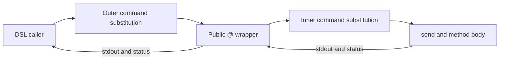

# Result passing for compiled Trashtalk methods

Status: guarded Option A implemented, disabled by default; integration evaluation below.
The public result ABI is unchanged. Design date: 2026-09-05; evaluation: 2026-09-06.

## Recommendation

**Guarded Option A is implemented as an opt-in optimization:** remove the
redundant inner capture for proven simple value sends, while retaining the outer
subshell and public `@` behavior. The experiments below support that bounded
change; they do not support an unrestricted removal of the capture.

Option B was faster for simple calls, but its additional application benefit
did not consistently meet this evaluation's threshold for adopting a new ABI.
More decisively, the B prototype still fails the caller's `set -e` contract.
Argument checks, validation at each numeric read, protected error fallbacks,
and shared receiver preparation were necessary but insufficient. Retain B as a
measured future option, with compatibility work still outstanding.

The four preceding improvements already reduce Block decoding, object
initialization, instance reads, and build validation. This proposal targets the
remaining cost of transporting a method result between Bash functions.

## Implementation scope

`TRASHTALK_VALUE_SEND=1` opts compilation and runtime collection callbacks into
guarded A. Compiled assignments retain their outer command substitution and
use a private entry point sharing receiver preparation with `@`. Setting the
runtime flag to `0` forces fallback even for opted-in artifacts. The build
receipt records the compilation setting so toggling it rebuilds affected code.
Public terminal sends and explicit Bash `$(@ ...)` expressions retain their
current behavior. Old compiled artifacts work with the new runtime; opted-in
artifacts require the new runtime.

Eligibility comes from the parsed DSL body: one return of a safe literal, an
argument, or addition/subtraction/multiplication over integer literals and
arguments. Field reads remain captured: a type check of the receiver snapshot
cannot prove the value is still numeric when the field helper reads it.
Raw methods, direct pragmas, aliases, class variables, nested sends, and arbitrary
shell expressions receive no capability. Arguments are checked at runtime;
echo-sensitive values fall back. Only own methods selected
by normal class/instance precedence qualify; inherited and trait dispatch fall
back. Advice, profiling, active exception frames, tracing and special shell
execution modes also fall back.

Capabilities belong to a compiled class generation. Sourcing a new artifact
resets them, clearing a class cache invalidates them, and legacy accessor
generation invalidates the getter/setter it replaces. External raw Bash code
that replaces compiled functions must first call
`_trash_invalidate_value_methods ClassName`; arbitrary shell monkey-patching is
outside this optimization's contract. No selector-wide promise survives reload.

Integration validation covers compiler/runtime regressions for lowering, mode
changes, dispatch, reloads, output/status, shell isolation and strict mode,
followed by sequential off/on measurements of compiled assignments and callbacks. Historical prototype results below remain separate from
those integration measurements. Option B is deferred.

## Initial integrated measurements, 2026-09-06

Two independent 24-round runs exercised actual compiled assignment bodies and
runtime callbacks, with 672 validated timed batches total. Paired median
improvements follow; negative numbers mean slower execution.

| Workload | Run 1 | Run 2 |
| --- | ---: | ---: |
| Constant return | +22.4% | +21.6% |
| Integer argument addition | +19.8% | +17.5% |
| Nested simple sends | +6.3% | +3.1% |
| Field getter (fallback) | -2.2% | -1.1% |
| 25-item class-callback map | -1.2% | +3.5% |
| 25-item Block map | +6.0% | -3.8% |
| Ten browser records | -2.7% | -8.4% |

Constant and integer-return gains repeated with positive confidence intervals.
The integrated class-map gain did not meet the earlier repeated 5% application
gate: its intervals included zero in both runs. Browser fallback was 8.4% slower
in the second run (95% interval: 3.7% to 14.9% slower), although that regression
did not repeat in run 1. These measurements support the narrow opt-in capability;
they do not qualify a default-on rollout or reproduce the prototype's map gain.

The shared host was busy and batch tails were broad. These are paired batch
measurements, not individual-request tail latency. Detailed medians, p95 batch
means, intervals, host load, source hashes and raw CSV checksums are preserved in
[run 1](../experiments/result-passing/results/2026-09-06-integrated-run1.json) and
[run 2](../experiments/result-passing/results/2026-09-06-integrated-run2.json).

## Experimental results, 2026-09-06

**Experimental decision: implement guarded A as a small, disabled-by-default
compiler/runtime change. That integration is described above. Do not promote
unrestricted A or the current B prototype.**

The experiments ran against `8c05160` on Darwin arm64 with Bash 5.3.15. All
prototype changes were confined to disposable repository copies. The regular
compiler and runtime were not switched to an experimental ABI.

### Performance

Two independent runs used 24 balanced rounds across six variants. Each timed
batch checked successful completion and its expected result. Candidate A used
ordinary assignments with a different captured entry point; candidate B called
its result-destination entry point directly. The baseline used the original
compiled assignments. A separate generic-helper control exposed wrapper
overhead, which was removed from the final candidate call sites.

The table gives median **paired percentage improvement** against the original
code in run 1 / run 2. Negative numbers mean a slowdown. These are local results,
not guaranteed improvements for arbitrary Trashtalk programs.

| Workload | Guarded A | Guarded B, shared preparation |
| --- | ---: | ---: |
| Constant class return | +20.7% / +21.4% | +73.5% / +72.8% |
| Assigned numeric getter | +3.1% / +8.3% | +13.5% / +14.8% |
| Two-field arithmetic return | +5.9% / +4.6% | +11.8% / +8.7% |
| Nested simple sends | +12.3% / +11.6% | +28.3% / +26.5% |
| Array map, 25 values, class identity callback | +10.4% / +6.9% | +17.8% / +18.7% |
| Array map, 25 values, Block callback | -1.4% / -2.4% | -0.1% / -4.4% |
| Browser records, ten Counter instances | +2.6% / +1.0% | +0.0% / -3.1% |

For scale, constant returns took 1.59–1.63 ms in the original path,
1.24–1.32 ms with A, and 0.43–0.44 ms with B. Class-callback maps took
90.1–95.8 ms originally, 83.1–87.2 ms with A, and 74.9–78.1 ms with B.
Those are per-run medians; percentage changes above use paired rounds rather
than ratios of independent medians.

The second run's class-map interval was noisy and included zero for A. A
focused follow-up used 36 rounds of three maps per batch, with the same
implementations. It found **8.9% improvement for A** (paired-bootstrap 95%
interval **2.6% to 12.1%**) and **16.7% for B** (**13.3% to 19.6%**).
The median map times were 94.94 ms originally, 87.33 ms with A, and 78.13 ms
with B. This confirms a useful A gain on that workload. Getter/arithmetic
gains were less consistent, and neither guarded option demonstrated a useful
gain on the Block-map or browser workloads.

The initially naive B fallback repeated receiver preparation. In the final
comparison it slowed Block maps by approximately 42–43% and browser records
by approximately 2–8%. Reusing preparation removed most of that penalty. This
is an implementation requirement for any future result-destination path.

The decision rule favored the least invasive compatible option with a repeated
median application gain of at least 5%, without a repeated regression above 5%.
B needed at least ten additional percentage points of application gain over A
to justify the larger ABI change. Its additional class-map gain was about
7.5 / 11.8 points in the full runs and 7.8 points in the focused run, so that
larger benefit did not repeat. Its remaining compatibility failure independently
rules out promoting the current B prototype.

### Compatibility findings

The primary matrix compared **53 cases**: returned bytes, incidental stdout,
stderr, status, last result, caller locals/directory/options/traps, runtime
stack/error state, live object state, and persisted state. It covers nested
sends, callbacks and captured receivers, direct methods, inheritance, traits,
overrides, a recompiled replacement, legacy metadata, advice, profiling,
exception cleanup, missing arguments, invalid numbers, and a write between
receiver resolution and the field read. Diagnostic locations and profiling
times are normalized; method results are compared without such normalization.

- **Unrestricted A failed three cases.** A raw result of `-n` changes from empty
  output to literal text; backslash escapes change under `xpg_echo`; and a
  method observing `BASH_SUBSHELL` sees a different nesting depth. The existing
  echo behavior may deserve a separate language change, but bypassing it is
  not a compatible performance optimization.
- **Guarded A matched all 53 cases.** Only seven explicitly selected compiled
  scalar-return methods were eligible. Unknown methods and behavior-sensitive
  contexts used the original path.
- **Unchecked B aborted the caller in five error cases.** These include missing
  arguments, malformed arithmetic values, and the intervening-write fixture.
  Checking a stale receiver snapshot alone is insufficient. B was revised to
  validate arguments and each actual numeric read, with the old capture
  boundaries around invalid-value fallbacks. Both B variants then matched the
  primary 53-case matrix. These protections are included in the timing results.
- **B still failed a separate strict-shell probe.** With caller `set -e`, even
  a successful constant send exits before returning. The trace stops at
  `((_CALL_DEPTH++))`: it evaluates to zero on entry, returns a failing shell
  status, and now executes in the caller. C and A complete the same call. The
  probe makes existing EXIT cleanup nonfatal to isolate the method's behavior.
  B therefore needs further treatment of shell options and dispatch internals;
  being a pure constant-return method is not sufficient for safe direct execution.

Instrumented dispatch confirmed transport depths of **2 / 1 / 0** for C / A / B
on an eligible scalar send. All 25 class-map callbacks were traced as well,
confirming removal of one capture per callback in A and two in B. Field helpers,
JSON tools, and the enclosing map still have their own process costs.

The ordinary repository's `make verify` passed **38 runtime and 42 compiler test
files**. This validates the production checkout; prototype compatibility is
supported by the differential matrix and strict-shell probe above, not by a
claim that the experimental ABI passed the entire production suite.

### Reproduction and limits

The [experiment runner and protocol](../experiments/result-passing/README.md)
include DSL fixtures, guarded and unrestricted prototypes, timing validation,
and commands to reproduce both the successful and deliberately failing probes.
Saved summaries include medians, p95 of batch means, paired-bootstrap intervals,
host load, source hashes, and references/checksums for the raw timing CSVs:

- [Full run 1](../experiments/result-passing/results/2026-09-06-run1.json)
- [Full run 2](../experiments/result-passing/results/2026-09-06-run2.json)
- [Focused mapping run](../experiments/result-passing/results/2026-09-06-focused.json)
- [Unchecked B failures](../experiments/result-passing/results/2026-09-06-unchecked-b.json)
- [Strict-shell probe and failure trace](../experiments/result-passing/results/2026-09-06-strict-mode.json)

There are 2,016 timed batches in the full runs and 216 longer batches in the
focused run, excluding warmups. Measurements used isolated state, warm class
metadata, sequential workloads, and rotating variant order. No tests/builds ran
concurrently with the final timing runs. The machine was shared and its load
varied, so intervals and repeat runs qualify the wall-clock claims. The p95
values describe batch averages, not individual-request tail latency.

This was a bounded prototype, not an effect checker or production compiler
pass. It does not qualify arbitrary raw methods, arbitrary replacement of Bash
functions outside compilation/reload, every shell option combination, or a
mixed-version rollout. In particular, B's known `set -e` failure remains in the
experiment as evidence. The integrated A implementation now supplies AST-based
lowering, managed capability invalidation, and normal-suite regressions within
the narrower eligibility contract above.

## The current path

For this DSL assignment:

```smalltalk
answer := @ counter getValue.
```

The generated Bash currently resembles:

```bash
answer="$(@ "$counter" getValue)"
```

Inside `@`, the ordinary path does this:

```bash
result=$(send "$@")
status=$?
[[ -z "$result" ]] || __="$result"
[[ -z "$result" ]] || echo "$result"
return "$status"
```

The public wrapper also resolves the receiver, sources its class, and checks
`pragma: direct`. `send` owns selector parsing, dispatch, runtime context,
advice, exception cleanup, and profiling. The snippets above omit those steps;
they are not replacement implementations.



This means two nested command substitutions for an ordinary assigned send,
although the method may only print a number. A bare terminal `@` call has one.
Other expressions, field helpers, and nested sends can introduce more.

Bash runs ordinary command substitutions in a subshell environment and removes
trailing newlines from the captured output. That is part of the existing
behavior, not just an implementation cost. See the
[Bash command-substitution contract](https://www.gnu.org/s/bash/manual/html_node/Command-Substitution.html).

## Observable behavior to preserve

| Concern | Current behavior and required compatibility |
| --- | --- |
| Public result | Ordinary `@` sends emit the captured nonempty result to stdout. Diagnostics use stderr. |
| Last result `__` | A nonempty result updates `__` in the shell executing `@`. An empty result leaves it unchanged. Updates made inside an outer capture do not reach its parent shell. |
| Whitespace | Ordinary capture strips trailing newlines. Embedded newlines, quotes, and empty strings need explicit coverage. Bash variables cannot represent NUL. |
| Status | Method status flows back through dispatch. A failed method can also produce stdout. A new transport must not silently convert that into success or discard the output. |
| Caller error policy | Ordinary assignment and checked JSON primitives do not currently have identical failure handling. Transport changes must preserve the caller's existing policy. |
| Shell effects | Normal capture isolates shell-variable, directory, option, and trap changes. File, database, and external-process effects can remain visible. |
| Direct methods | `pragma: direct` bypasses the inner capture. Callback bindings, reload operations, and terminal operations depend on their existing execution environment. |
| Dispatch | Receiver resolution, inheritance, traits, overrides, and class reloads remain authoritative. The compiler cannot assume a selector always names one fixed Bash function. |
| Cleanup | Advice, ensure/handler stacks, call-stack cleanup, and profiling must run with the same ordering and status behavior. |
| Reentrancy | Nested sends and callbacks must not overwrite an outer method's pending result or runtime context. |

Dynamic local-variable visibility is another reason to avoid a single global
result slot: called Bash functions can see locals in their callers. Use distinct,
validated compiler-owned names and explicit frame ownership. See
[Bash function scoping](https://www.gnu.org/s/bash/manual/html_node/Shell-Functions.html).

## Option A: one capture for compiled value sends

Add a private runtime entry point used only inside a compiler-generated capture:

```bash
# Emitted for an opted-in DSL assignment:
answer="$(_trash_value_send ResultProbe constant)"
```

`_trash_value_send` shares the public wrapper's receiver preparation and
method-mode checks, then runs the normal dispatcher without capturing its output
again when the selected method qualifies. The surrounding substitution still captures stdout and supplies the
isolation boundary.

This is not simply replacing `@` with `send`. In particular:

- Class/trait loading and direct-method selection must use the same logic.
- Public-wrapper output normalization must be reproduced where observable;
  `echo` behavior and whitespace deserve differential tests.
- `__` behavior must be checked for methods that inspect or modify it, including
  nested calls and advice. Its value cannot be assumed irrelevant everywhere.
- Direct methods and terminal operations should initially retain their current
  path rather than being routed through a new capture policy.
- `exit`, traps, `BASHPID`, shell options, and cleanup can observe a changed
  subshell boundary even when ordinary text results match.

The implementation allows only the small parsed subset specified above and
falls back for everything else. It adds no DSL syntax or public dispatcher.

**Potential benefit:** remove one result-transport subshell per eligible assigned
send. **Limit:** one outer capture remains, and external commands or JSON work
inside the method remain additional costs. The measured gains and limits are
recorded in the evaluation above.

## Option B: a private result channel

A larger change gives eligible compiled methods a result destination. Conceptually:

```bash
# Proposed shape only:
local __tt_result_17=''
_trash_send_into __tt_result_17 "$counter" getValue
status=$?
answer=$__tt_result_17
```

The generated method writes the language value through a runtime result helper.
The dispatcher returns a Bash status separately. Public `@` adapts that value
back to the existing stdout contract. Legacy compiled methods and raw methods
continue through a stdout-capturing adapter.

A robust version needs all of the following:

1. **A versioned capability marker on each generated method.** Dispatch checks the
   implementation actually selected at runtime, including overrides and traits.
   Reload must invalidate the resolved capability along with the method.
2. **A frame-owned destination.** Nested calls need different slots. Validate
   destination names and reserve a compiler prefix; never evaluate a user-supplied
   assignment expression. Retain the supported Bash baseline when choosing
   builtins instead of assuming newer nameref features are available everywhere.
3. **A distinction between method value and method output.** Today both travel
   through stdout. A method may print a progress line and then return a value;
   a new ABI must preserve the resulting public output or use the legacy adapter.
4. **An eligibility/effect rule.** Executing a method in the caller's shell can
   expose shell effects that were previously isolated. Merely being written with
   `method:` is insufficient: a DSL method can call a raw or dynamically overridden
   method. Unknown effects require fallback.
5. **Failure and early-return handling.** Returning an empty value is different
   from failing. Explicit returns, callback returns, ensure handlers, and failures
   after partial output need a defined representation and cleanup order.
6. **Mixed-artifact support.** New runtime/old compiler and old runtime/new compiler
   behavior must be deliberate. Prefer adapters and a feature gate during rollout;
   incompatible artifacts must fail clearly rather than corrupt values.

A conservative first subset could be generated constant returns and arithmetic
methods with known field reads and no unknown message sends. Extending it to
arbitrary methods would require a larger effect and output model.

**Potential benefit:** zero result-transport captures for eligible internal sends.
**Cost:** a new compiler/runtime interface plus a compatibility policy for shell
execution and output. Public terminal calls still need their normal presentation.

## Option C: keep the current result ABI

Continue reducing work inside methods: bulk JSON operations, precomputed metadata,
shared state decoding, and efficient Block invocation. This remains a reasonable
choice if Option A produces only a small application-level improvement, or if
its compatibility adapters erase the benefit.

| Option | Assigned-send captures | Scope | Main risk |
| --- | ---: | --- | --- |
| Current ABI | 2 | Existing implementation | Repeated transport overhead |
| A: shared preparation, one capture | 1 for eligible calls | Private entry point and compiler lowering | Observable differences at the removed boundary |
| B: result destination | 0 for eligible calls | Versioned method ABI, adapters, effect rules | Shell/output semantics and mixed artifacts |

These counts cover transport of one ordinary assigned send, not all subprocesses
within its implementation.

## Integration validation and remaining decisions

The default build passed `LC_ALL=C TRASHTALK_VALUE_SEND=0 make verify`: 39 runtime
and 43 compiler test files. The enabled build passed
`LC_ALL=C TRASHTALK_VALUE_SEND=1 make test`: all 39 runtime files. The dedicated
compiler regression builds both modes, checks assignment lowering and capability
exclusions, verifies duplicate definitions/aliases, and toggles build receipts
in both directions. The dedicated runtime regression compares stdout, stderr,
status, caller locals/options/directory/traps, last result, runtime stack/error
state, session JSON and persisted JSON.

Coverage includes option-like and multiline results, failures and early exits,
nested sends, field mutations, direct callbacks, inherited/trait/overridden
methods, a deterministic intervening field write, exception frames, profiling,
strict mode, legacy metadata, reload and accessor replacement. Dispatch tracing
checks two versus one captures for eligible assignments and five versus four
for every class callback in a collection map. Private helper stack-frame names
are implementation details; public language results are the compatibility target.

The feature remains opt-in. Broader field-read eligibility requires validation
at the actual read without changing observable state or erasing the saving.
Arbitrary raw Bash function replacement requires explicit capability invalidation.
A future result-destination ABI still needs the strict-shell and output contracts
resolved. Representative user applications, beyond the mapping and browser
workloads measured here, should determine whether either scope should expand.

## Code pointers

- `lib/trash.bash`: `@`, `send`, `_send_cleanup`, receiver resolution, and profiling.
- `lib/jq-compiler/codegen.jq`: assignment/return lowering and message expressions.
- `trash/Block.trash` and `lib/trash-json.bash`: direct callback execution.
- `tests/test_value_send.bash` and `lib/jq-compiler/tests/test_value_send.bash`: integrated regressions.
- `experiments/result-passing/integrated.py`: reproducible compiled off/on measurements.
