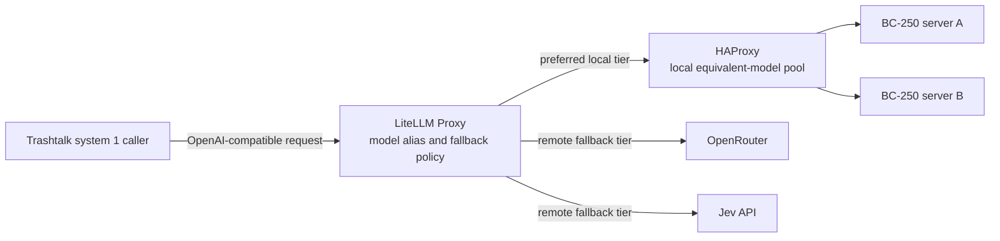

# System 1 model routing

**Status:** Proposed design. No LiteLLM, HAProxy, service Tool, or routing behavior is implemented by this document.

## Decision

Trashtalk will add a narrow routing layer for Jev and Jev-like **system 1**
models. System 1 means a fast model used for bounded, low-latency work. The
layer will select a healthy equivalent backend from local BC-250 inference,
OpenRouter, or Jev's API.

The initial implementation will use LiteLLM Proxy as the model-aware gateway.
HAProxy will balance and actively health-check only a pool of equivalent local
BC-250 inference servers. Trashtalk will call one stable LiteLLM endpoint.

This is not a change to Trashtalk's broader agentic surface. Agent sessions,
Agent::Driver selection, assignment dispatch, tools available to agents,
conversation protocols, and existing harness integrations remain unchanged.
They continue to use their current backends until a separate design changes
them.

## Goals

- Send a system 1 request to a healthy backend with minimal added latency.
- Prefer a suitable local BC-250 backend before remote paid providers.
- Fail over only among models that meet the request's declared requirements.
- Give Trashtalk one OpenAI-compatible request surface.
- Preserve streaming without buffering generated tokens in the router.
- Keep provider credentials, backend topology, and health policy outside agent
  prompts and ordinary application callers.
- Make routing outcomes observable enough to debug latency, failure, cost, and
  fallback decisions.

## Non-goals

- Replace existing agentic model selection or agent harnesses.
- Treat all text models as interchangeable.
- Retry tool calls or other side-effecting work after output begins.
- Build a general API gateway, provider billing system, or user-facing model
  marketplace.
- Add a database or Redis to the first deployment.
- Make LiteLLM responsible for local process management or BC-250 inference
  server startup.

## Architecture



### Responsibility boundaries

| Component | Owns | Does not own |
| --- | --- | --- |
| Trashtalk | Task classification, capability requirements, caller deadline, idempotency classification, request audit fields | Health probes, provider API differences, local-server load balancing |
| LiteLLM Proxy | Stable model aliases, provider adapters, ordered fallback, deployment cooldown, provider-specific authentication | Agent dispatch, backend process lifecycle, tool side-effect safety |
| HAProxy | Active health checks and load balancing for an equivalent local BC-250 pool | Cross-provider fallback, model aliases, request transformations |
| BC-250 server | Inference and a cheap readiness endpoint | Global routing policy |
| OpenRouter and Jev | Remote inference behind provider-specific credentials | Local health and capacity state |

The extra hop is one local HTTP proxy hop. LiteLLM must pass streaming response
bytes through as they arrive. HAProxy only sees traffic for the local tier.
Remote providers must not be hidden behind HAProxy because their APIs and
fallback semantics are not equivalent to a local inference pool.

## Routing contract

Trashtalk must request an internal model alias, not a provider model name. An
alias represents a capability contract and an ordered list of equivalent
deployments. Examples are illustrative:

- `tt/system1/jev`: fast Jev-compatible text generation.
- `tt/system1/jev-tools`: Jev-compatible generation that supports the required
  tool-call format.
- `tt/system1/jev-json`: Jev-compatible generation that can meet the selected
  structured-output contract.

Each alias must declare, in configuration or a small Trashtalk registry:

- maximum usable context and output limits;
- supported request and response features, including streaming, JSON mode, and
  tools;
- expected system prompt and safety behavior where this affects correctness;
- local and remote deployments allowed to serve the alias;
- tier order, per-tier timeout, and retry eligibility.

Do not place a provider in a fallback chain only because its model name looks
similar. A candidate must be compatible with the request's context length,
tool protocol, response format, and expected behavior. If no deployment meets
the contract, return an explicit capability error. Do not silently degrade to
an arbitrary model.

The initial policy for a Jev-compatible alias is:

1. Select a healthy server in the equivalent local BC-250 pool.
2. Select an approved OpenRouter deployment.
3. Select the approved Jev API deployment.

The exact remote order is alias-specific. It can change when Jev provides the
more compatible model, or when cost and latency data support a different
choice. The configured order, not an implicit vendor preference, is the policy.

### Minimum initial capability registry

Start with a static, versioned configuration containing two text-only aliases.
It is a small capability registry, not a database, a dynamic discovery service,
or a general model catalogue.

```text
tt/system1/jev
  deployment: OpenRouter, exact verified Jev model ID
  capabilities: text, streaming only
  route: OpenRouter only

tt/system1/mapika-decider
  deployment: one BC-250 OpenAI-compatible endpoint, exact verified model ID
  capabilities: text, streaming only
  route: local BC-250 only
```

Treat mapika/decider as one alias only if it is one deployed model artifact. If
Mapika and Decider are independently selected models, create one alias for each.
Do not fall back between Jev and mapika/decider. They have not yet established
behavioral equivalence.

Each deployment record must contain the exact provider model ID, non-secret
endpoint reference, context and output limits, supported features, time to
first-token timeout, and health policy. Before verification, mark JSON mode,
structured output, tool calls, and cross-provider fallback as unsupported.
Endpoint addresses and API-key references stay in separately managed runtime
configuration, not in this registry.

The first usable failure policy is intentionally narrow: if OpenRouter cannot
serve Jev, return an unavailable result for `tt/system1/jev`; if the BC-250
cannot serve mapika/decider, return an unavailable result for that alias. Add a
fallback tier only after its model passes the alias compatibility contract.

Within a local pool, use weighted or least-busy selection only among genuinely
equivalent deployments. Do not enable latency-based routing until the system
has stable measurements. A low observed latency can otherwise steer traffic to
a server with an empty queue but poor output quality or imminent saturation.

## Health, overload, and fallback

Health has two signals. A readiness probe answers whether an endpoint can
accept work. Request observations answer whether it can serve useful inference
within the required time.

### Local BC-250 pool

HAProxy will actively probe a non-inference endpoint such as authenticated
`GET /healthz`. If the inference server has no dedicated readiness endpoint,
use a cheap authenticated `GET /v1/models`. Do not issue paid generation calls
as probes.

Start with a two-success rise threshold and a three-failure fall threshold.
Probe every two to five seconds. Tune this after measuring normal startup,
model-load, and queue behavior. A green readiness endpoint does not prove that
the server has usable inference capacity.

LiteLLM receives the local tier through HAProxy. HAProxy removes failed local
servers before LiteLLM selects the tier again. Export HAProxy queue depth and
response timing with LiteLLM request observations to identify a ready but
saturated server.

### LiteLLM deployments

Enable LiteLLM's configurable background health-check routing for deployments
that it probes directly. Keep its interval modest and use a non-billed request
where the upstream provides one. LiteLLM cooldowns provide a circuit breaker:
a deployment that crosses the configured failure threshold is temporarily
removed, then reconsidered after its cooldown and a successful probe.

Remote provider health is primarily inferred from real requests. OpenRouter is
one upstream gateway. Its internal provider choice does not make a local or
Jev backend healthy, and its own provider fallback policy needs separate cost
and capability controls.

Record these signals per alias and deployment:

- availability and failure class;
- time to first token and completion time;
- HTTP 429 rate, selected 5xx rate, and timeout rate;
- stream-abort rate;
- selected tier and whether a fallback occurred.

## Retry and streaming rules

A retry is safe only when Trashtalk knows that no response bytes were delivered
and the operation is idempotent, meaning that repeating it has no additional
side effect.

Retry eligible failures are transport failures, connection refusal, a caller
or tier timeout before output, 408, 429, and selected transient 5xx responses.
Do not retry authentication failures, malformed requests, unsupported-feature
responses, or other schema and policy 4xx responses.

For a streamed response, do not automatically fail over after the first output
byte reaches Trashtalk. The next backend can repeat, contradict, or omit prior
tokens. Return the stream failure to the caller with the partial content where
the existing response contract permits it.

A request that could execute a tool, mutate a remote service, or initiate a
workflow is not fallback-safe by default. It needs an idempotency key and a
separate proof that every side effect is safe to repeat. The first system 1
routing use cases should be text-only or otherwise side-effect-free.

Set a total caller deadline and give each tier a smaller budget. An initial
starting point is five to fifteen seconds to first token locally and twenty to
thirty seconds remotely. Reserve enough total deadline for one fallback. Tune
from real time-to-first-token measurements rather than allowing each tier to
consume the whole caller deadline.

## Trashtalk integration

The first integration point is a narrow system 1 client, not a global model
provider replacement. It accepts a task request, selects an internal alias,
and sends an OpenAI-compatible request to LiteLLM. It records the alias,
request class, selected route if reported, timing, and outcome without logging
credentials or prompt content by default.

Existing callers that do not opt into the system 1 client retain their current
behavior. Agentic work remains outside this layer. This containment lets the
system prove routing, streaming, and fallback behavior without changing
assignment or session semantics.

### Tool and service abstraction

`Tool` currently models an external executable. It provides executable lookup,
installation, exact argv construction, child-directory selection, capture, and
detached process execution. A remote LiteLLM deployment is a service, not a
CLI. Forcing it into the existing installation and `PATH` contract would blur
the distinction and create misleading `ensure` behavior.

Prefer a composable trait, tentatively named `ServiceClient`, rather than a
new `Tool` subclass hierarchy. The trait should define the common service
boundary:

- configured endpoint identity and non-secret display name;
- explicit readiness and liveness query contract;
- authenticated request construction without exposing secrets in argv, logs, or
  result envelopes;
- timeout, cancellation, streaming, and normalized transport-error handling;
- a structured result envelope that distinguishes unavailable, timeout,
  rejected request, and partial-stream outcomes.

The protocol describes a service boundary. It must not perform HTTP itself.
Add a distinct `ServiceTransport` primitive that accepts a structured request,
owns HTTP execution, and returns either a normalized result or a stream event
sequence. Its request contract must include an endpoint reference, method,
path, non-secret headers, request body, connect deadline, total deadline, and
whether the caller requests streaming. Its result contract must preserve the
opaque request ID, status, normalized outcome, time to first byte, completion
timing, and any partial-stream failure.

Use a short-lived `curl` child for the first transport implementation. Its
startup cost is negligible beside model time to first token, while it gives the
first proof a simple failure and cancellation boundary. Run streaming curl with
output buffering disabled and pass bytes through as they arrive. Cancellation
must terminate the child process group. Do not buffer a completed response just
to parse it as JSON.

Do not put authorization headers or API keys in argv, result envelopes, or
ordinary logs. Resolve credentials by a non-secret endpoint reference and pass
them through protected runtime configuration or inherited process environment.
If curl requires a header file, create it with restrictive permissions and
remove it after the request. The first LiteLLM Proxy should bind locally, so
the client may not need a separate client credential at all.

A future `Tools::LiteLLM` class can compose the transport and expose a small
OpenAI-compatible operation surface: endpoint identity, readiness, model
discovery, completion, and streaming completion with an internal alias. It is
not a `Tool` subclass merely because the first transport invokes curl. `Tool`
models installable executables and argv operations. Keep LiteLLM service calls
separate from a possible local proxy supervisor. If Trashtalk later launches a
LiteLLM binary or container, that supervisor can use `Tool` process primitives
without making request execution pretend to be a CLI.

Do not add a persistent HTTP sidecar yet. Add connection pooling only if
measurement shows that curl startup or lack of connection reuse affects the
system 1 latency budget. The first transport proof must cover one loopback
LiteLLM Proxy, successful streaming text, cancellation, timeout, and an
unavailable result.

Do not add the trait before the LiteLLM proof of concept identifies the shared
needs. If LiteLLM remains the only service adapter, a narrow `Tools::LiteLLM`
implementation is enough. Extract `ServiceClient` only when a second service
uses the same endpoint, authentication, timeout, and streaming contract. This
avoids creating an abstract framework from one integration.

## Deployment shape

Run one LiteLLM Proxy instance first. Keep its configuration and secrets in the
existing local deployment mechanism, outside prompts, source control, and
process arguments. Expose it only to the local Trashtalk environment unless a
separate access-control design expands that boundary.

Do not use Redis initially. A single LiteLLM instance can keep cooldown and
routing state in memory. Add Redis only when multiple LiteLLM replicas require
shared cooldown, quota, or rate-limit state. Redis adds a network call and
operational failure mode to each routing decision.

HAProxy is optional when there is one local BC-250 endpoint. Introduce it when
two or more equivalent local inference servers need active health checks and
load balancing. With one endpoint, LiteLLM can target it directly and perform
its own configured health checks.

## Configuration principles

- Keep API keys in secret storage or environment supplied to the service.
- Keep stable internal aliases in versioned configuration.
- Keep live endpoint addresses and operational credentials separately managed.
- Store capability declarations with the alias, not in agent prompts.
- Log opaque request IDs, aliases, deployment IDs, timings, and outcomes.
- Do not log authorization headers or full prompts and completions by default.
- Make each fallback tier visible in traces and metrics.

## Rollout and acceptance gates

1. Define one Jev-compatible text-only alias and its compatibility contract.
2. Run LiteLLM with one local endpoint, one OpenRouter deployment, and one Jev
   deployment. Keep all existing agent callers unchanged.
3. Add a deliberately failing local endpoint. Verify that it is excluded, a
   remaining healthy local endpoint is selected, and one remote fallback stays
   within the total deadline.
4. Verify streaming success and confirm that an interrupted stream is not
   retried after its first emitted byte.
5. Add HAProxy only when testing an equivalent multi-server BC-250 pool. Verify
   rise/fall behavior with a non-inference health endpoint.
6. Measure added time to first token, fallback rate, error classification, and
   local versus remote selection before changing routing policy.

The first deployment is acceptable when a system 1 request reaches a healthy
compatible local server when available, falls back only according to its alias
contract, preserves streaming semantics, and leaves all non-system-1 agentic
paths unchanged.

## Risks and open decisions

- BC-250 inference endpoints and their real readiness/capacity metrics need
  verification. A health endpoint can be green while the model is unloaded or
  the queue is saturated.
- Jev API and intended OpenRouter model compatibility need a written capability
  matrix before they share an alias.
- LiteLLM's exact health-check, fallback, and streaming behavior must be tested
  against the deployed versions, not assumed from documentation.
- The initial error/result envelope must fit existing Trashtalk JSON and stream
  contracts before implementation.
- The need for a reusable `ServiceClient` trait remains an implementation
  decision. A second service adapter is the threshold for extraction.

## References

- [LiteLLM routing](https://docs.litellm.ai/docs/routing)
- [LiteLLM health-check routing](https://docs.litellm.ai/docs/proxy/health_check_routing)
- [HAProxy health checks](https://www.haproxy.com/documentation/haproxy-configuration-tutorials/reliability/health-checks/)
- [Current Trashtalk Tool adapters](code-and-session-tools.md)
- [Agent delegation implementation](agent-delegation-implementation.md)
