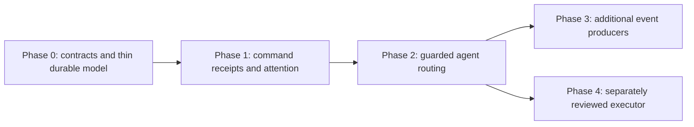

# Workstation event layer: phased implementation plan

**Status:** Proposed task plan, 2026-09-14.

This is the execution companion to
[the workstation event, attention, and delegation design](workstation-event-attention-delegation.md).
It deliberately starts with the smallest durable model built on existing Honker
`Stream`, Store, Inbox, AgentQueue, and AgentWorker contracts.

## Delivery rules

- A phase is not “mostly done”. Its acceptance gates must pass before beginning
  the next phase.
- Use `Persistable`, `Store transaction:`, `Require`, `AgentAccess`, and the
  existing Honker `Stream` wrapper. Do not add raw SQLite or a second event log.
- `EventSubscription` and `Attention` are the only new persisted domain classes
  in Phases 0 and 1. Honker owns stream messages and consumer offsets.
- Source adapters are stateless `EventSourceAdapter` subclasses. A raw method is
  permitted only at a real OS/Honker boundary.
- All fixtures use a disposable SQLite/Honker store. No paid model, desktop
  daemon, live watcher, or uncontrolled shell command is required.
- Commit each independently testable task. Keep migrations backward-compatible
  and document recovery for every new state transition.

## Dependency map

## Phase 0: contracts and thin durable model

### Purpose

Establish the two persisted records, CUE contracts, state invariants, and
Honker-coordinate idempotency storage without producing, consuming, or routing
a real workstation event. At completion, developers can create, validate,
inspect, transition, and migrate subscriptions/attention records in a
isolated database. The worker, Inbox, and agents are unchanged.

### Explicitly excluded

- No command wrapper or `CommandReceiptSourceAdapter`.
- No `AgentWorker` subscription tick stage.
- No Stream read/ack in production logic.
- No Inbox message/outbox publication, Whisker count, notification, or agent
  dispatch.
- No automatic action, approval, executor, filesystem watcher, or interval
  source.

### Task 0.1: establish the schema package and validation harness

**Deliverables**

- Add `schemas/workstation/v1/` with closed CUE roots for:
  - `#EventSubscription`
  - `#Attention`
  - a common stream-coordinate envelope
  - the future `command-receipt.v1` payload and safe display projection
- Include valid and invalid JSON fixtures next to the CUE package.
- Add a small test helper which invokes existing `Tools::Cue vet:json:` and
  reports CUE field-path diagnostics without echoing sensitive fixture content.
- Add a documented schema digest command for the package. The digest becomes
  metadata on the eventual feature policy revision, not a global runtime switch.

**Constraints**

- Definitions are closed for policy/security records; unknown fields fail.
- CUE validates structure only. It does not replace Store uniqueness, ownership,
  canonical paths, lifecycle, or authorization checks.
- CUE must not run inside a Store transaction or worker lock.
- A missing CUE binary fails the workstation feature's create/validate command
  clearly. It must not affect unrelated Trashtalk classes.

**Tests**

- Every valid fixture vets and every invalid fixture fails with a bounded
  diagnostic.
- Wrong `schema_version`, unknown fields, invalid state, malformed IDs, invalid
  debounce range, and malformed stream coordinates fail.
- The same fixture can be read as JSON by the normal Trashtalk JSON helpers.

### Task 0.2: define the `EventSubscription` persisted class

**Deliverables**

- Add `EventSubscription subclass: Object include: Persistable` with typed
  fields for owner, enabled flag, dispatch state, stream name, consumer name,
  adapter kind, filter JSON, debounce, target identity, grouping policy,
  revision, schema version/digest, timestamps, and explicit initial-position
  choice.
- Add DSL-facing class messages for create, read, list by owner, pause/resume
  dispatch, disable/enable, and inspectable summary/display projection.
- Add one transaction-only create/update selector that CUE-vets before the
  transaction and performs native semantic checks inside it.
- Canonicalize the workspace/target policy at the existing AgentAccess boundary
  when those fields are introduced, but do not resolve an agent session yet.

**Invariants**

- Consumer name is deterministic from immutable subscription ID and cannot be
  edited after creation.
- Only allowlisted adapter kinds and grouping policies are accepted.
- `enabled` and `dispatchState` are distinct. Neither mutates a Honker offset in
  Phase 0.
- A revision-changing update preserves immutable creation/consumer identity and
  writes an audit note/reason.
- Unknown CUE data, invalid owner, or malformed policy never persists.

**Tests**

- Create/reload/list round trip, including display columns.
- Duplicate ID/consumer-name rejection and invalid state transition rejection.
- CUE-valid but semantically invalid records, such as a non-allowlisted adapter,
  are rejected by native validation.
- Existing database records/classes remain readable after installing the schema.

### Task 0.3: define the `Attention` persisted class and state machine

**Deliverables**

- Add `Attention subclass: Object include: Persistable` with subscription,
  group key, state, optional root Message reference, first/last Stream
  coordinate, event count, snooze time, resolution/suppression note, timestamps,
  schema version/digest, and last resolved session as presentation metadata.
- Implement the transition table in one transactional selector:
  `open`, `acknowledged`, `snoozed`, `resolved`, and `suppressed`.
- Add DSL messages for acknowledge, snooze-until, resolve-with-note, suppress,
  reopen, summary, and safe display projection.
- Keep Message optional in this phase. Phase 1 creates and links it atomically.

**Invariants**

- A valid state transition is explicit and records actor/time/note when needed.
- Snooze requires a future normalized timestamp. Resolve/suppress require a
  nonempty reason. Acknowledging does not resolve.
- Group key is opaque canonical text at this layer. Its computation belongs to
  an adapter in Phase 1.
- Lifecycle actions never settle deliveries, answer Questions, or change a
  session/run state.

**Tests**

- Table-driven legal and illegal transition tests.
- Reload after every transition preserves state and display columns.
- No lifecycle action creates a Message, AgentDelivery, AgentRun, or Honker
  offset side effect.

### Task 0.4: add coordinate idempotency as internal storage

**Deliverables**

- Add a narrow internal Store schema/index mapping
  `(subscription_id, stream_name, partition, offset)` to `attention_id`.
- Expose transaction-only operations: `claimedCoordinate:`, `recordCoordinate:
  forAttention:`, and a bounded coordinate-range lookup for inspection.
- Do not model this mapping as a third public Persistable object.

**Invariants**

- The composite key is unique at the database boundary.
- Recording a coordinate and updating Attention count/range occur in the same
  Store transaction.
- A duplicate coordinate returns the existing Attention link and makes no
  counter or state change.
- Coordinates from different subscriptions or streams are never equal for
  idempotency purposes.

**Tests**

- Replay the same coordinate concurrently and prove one stored link/count.
- Roll back a forced transaction failure and prove neither link nor Attention
  update remains.
- Adjacent offsets extend the range; an out-of-order offset retains correct
  minimum/maximum and count.

### Task 0.5: create the adapter base and closed registry

**Deliverables**

- Add abstract `EventSourceAdapter` and the class-side contract from the design:
  `kind`, `validateSubscription:`, `consumerFor:`, `read:limit:`,
  `normalize:for:`, `groupKeyFor:`, and `displayFor:`.
- Implement `forKind:` as an explicit DSL allowlist. Initially it returns no
  production adapter or a test-only fixture adapter behind test setup.
- Add a fixture adapter that returns supplied normalized records without reading
  Stream. It validates the worker-facing envelope but performs no persistence.
- Add `EventSourceAdapterError` diagnostics for abstract/unknown calls.

**Invariants and tests**

- A persisted adapter class/selector/shell string can never determine dispatch.
- Unknown/disabled/schema-incompatible kinds fail before any source read.
- Base/fixture adapter output is bounded and includes stream coordinates.
- No adapter class writes Store records, sends Message, calls AgentQueue, or
  acknowledges a Stream offset.

### Task 0.6: migration, browser, and doctor integration

**Deliverables**

- Add idempotent schema migration installation to the existing migration
  mechanism. New tables/indexes are created once per database.
- Add `@ Trash doctor` checks for Honker Stream availability and CUE availability
  scoped to this feature, with remediation text and no automatic install.
- Add browser record projection tests for Subscription and Attention property
  columns. The generic instance inspector must show declared values on Enter.
- Add a concise operations/design cross-link explaining that Stream offsets,
  not an `EventCursor` object, represent consumer progress.

**Tests**

- Fresh database, database with unrelated persisted classes, and repeated
  migration install all succeed.
- Missing Honker/CUE reports unavailable feature capability but does not break
  basic build, Inbox, or existing agent operation tests.
- Browser projection never includes raw event payload/output or secret artifact
  contents.

### Phase 0 acceptance gate

Phase 0 is complete only when:

1. `EventSubscription` and `Attention` can be created, validated, reloaded,
   inspected, and transitioned with CUE plus native validation.
2. The coordinate index proves idempotent and transactional under replay tests.
3. No runtime code consumes/acks a production Stream or routes an Inbox message.
4. Existing full agent/browser/Store suites pass with and without optional CUE
   and Honker availability where their current contracts permit it.
5. The API, migration, CUE fixtures, and state table are documented before Phase
   1 introduces a single receipt producer.

## Phase 1: command receipts and local attention

Implement the command receipt producer, `CommandReceiptSourceAdapter`, fair
bounded Stream reads, post-commit offset acknowledgement, grouping, and atomic
Attention plus root Message publication. Add Inbox/AgentBrowser/Whisker
inspection, acknowledge/snooze/resolve actions, and replay/gap/debounce tests.
Automatic agent routing remains disabled.

## Phase 2: guarded agent routing

Add opt-in routing from an accepted Attention to the existing outbox. Enforce
identity session scope, workspace policy, recipient/message/run budgets,
causal metadata, no-recursive-lineage policy, and no-session/ambiguous/paused
outcomes. Test all paths before enabling it by default.

## Phase 3: additional producers

Add one producer at a time, beginning with interval or Git state. Each producer
publishes a closed, versioned record into its own Honker Stream and supplies its
own privacy, retention, debounce, replay, and portability tests. Do not add a
generic plugin ABI.

## Phase 4: restricted effects, separately designed

Do not reuse this plan to introduce mutation/approval. A future plan must first
provide an observation-only harness and a restricted executor that owns the OS
capability. Current harness role checks are cooperative controls, not a sandbox.

## Task rundown for Phase 0

| Task | Main result | Dependency | Estimated implementation shape |
| --- | --- | --- | --- |
| 0.1 | CUE package, fixtures, validation helper | existing `Tools::Cue` | docs/schema + test helper |
| 0.2 | `EventSubscription` class and native validation | 0.1 | DSL class + migration + tests |
| 0.3 | `Attention` class and transition table | 0.1 | DSL class + tests |
| 0.4 | private coordinate idempotency index | 0.2, 0.3 | narrow Store schema/transaction boundary |
| 0.5 | adapter superclass and closed registry | 0.2 | DSL base + fixture adapter tests |
| 0.6 | migrations, doctor, browser/docs | 0.1–0.5 | integration tests and projections |

The work should land in this order. Tasks 0.2 and 0.3 can be developed in
parallel after 0.1, but 0.4 must integrate both before its replay guarantees
are meaningful. Phase 0 should stay intentionally boring: it proves the data
contracts before any event can wake, notify, or delegate work.
